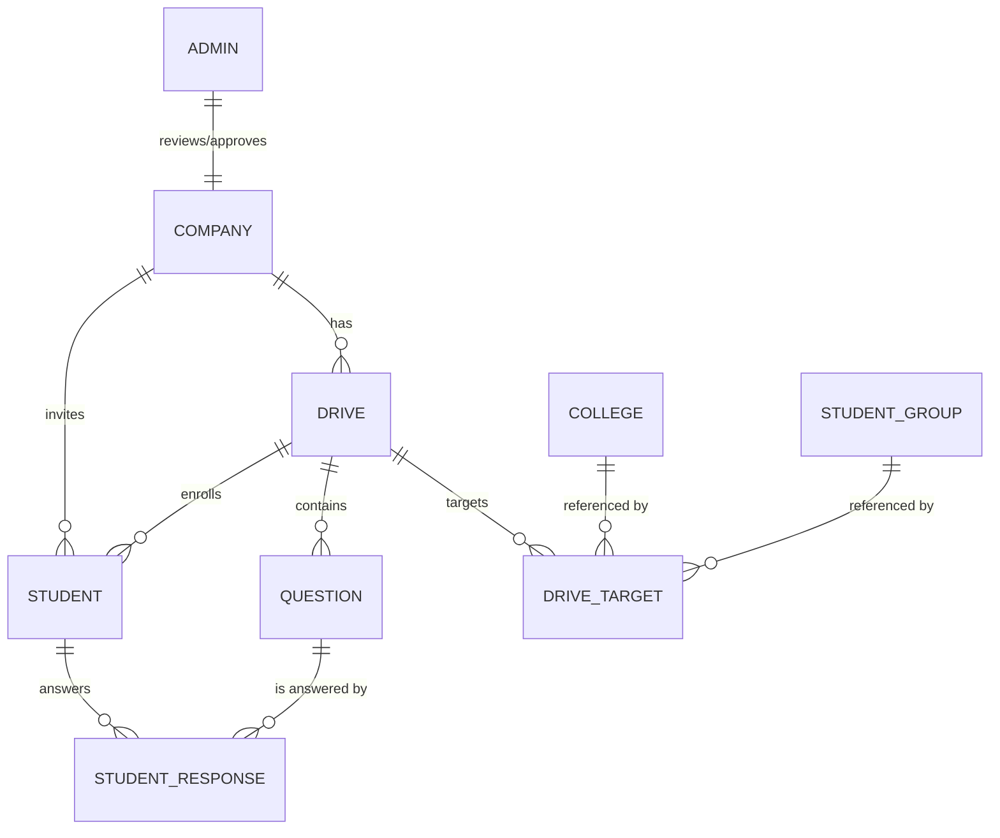

# System Overview

This document explains how the Company Exam Portal is structured, how the workflows move through the system, and how data is modeled across services.

## Architecture at a glance
- **Backend API (FastAPI)** in `backend/` handles auth, drive management, student management, question delivery, submissions, email sending, and anti-cheat tracking. Uses PostgreSQL via SQLAlchemy.
- **Admin/Company dashboard** in `frontend-react/` (React + Vite) for admins to review companies and for companies to manage drives, upload students, and trigger invites.
- **Student portal** in `student-portal/` (React + Vite) for students to log in with access tokens, take exams, and view results.
- **Email** via SMTP (configurable in `backend/.env`), sending access tokens and drive details.
- **CORS** configured in `backend/app/main.py` with environment-based origins; defaults allow local dev ports 5173/5174.

### High-level flow
1. **Admin onboarding**: Admin credentials from environment; approves/rejects company signups.
2. **Company onboarding**: Company registers/login, waits for admin approval.
3. **Drive setup**: Company creates a drive (title, category, schedule, duration) and targets colleges/groups.
4. **Questions & audience**: Company uploads/creates questions; uploads student roster (CSV) or manual adds.
5. **Invitations**: Company triggers email sends; backend issues per-student access tokens and dispatches SMTP invites.
6. **Exam delivery**: Students log in on the student portal with token, see randomized questions, take MCQ exam within window/duration.
7. **Monitoring**: Anti-cheat events (tab switches, fullscreen exits, etc.) stored on the student record; disqualification flag can be set.
8. **Scoring & results**: Answers stored as `student_responses`; scores computed/stored on `students`; companies view results via dashboard.

## Data model (ER diagram)
Mermaid diagram of primary entities (simplified to main relationships):

Key tables and columns:
- **companies**: `id`, `company_name`, `username`, `email`, `hashed_password`, `status`, `admin_notes`, email templates, timestamps.
- **drives**: `id`, `company_id`, title, description, category, schedule (`window_start/end`, `actual_window_start/end`), duration, status, approval flags.
- **drive_targets**: `drive_id`, optional `college_id`/`student_group_id`, custom names, batch year.
- **questions**: `drive_id`, text, options A-D, `correct_answer`, `points`.
- **students**: `drive_id`, `company_id`, student info, `access_token`, `question_order`, exam timestamps, scores, anti-cheat fields.
- **student_responses**: `student_id`, `question_id`, `drive_id`, selected option, correctness, timestamps.
- **colleges** & **student_groups**: master reference data.
- **admins**: platform admins, seeded from environment credentials.

## Request flows
- **Auth**
  - *Admin/Company*: JWT login; tokens signed with `SECRET_KEY` and `ALGORITHM`.
  - *Student*: token-based login using `access_token` issued per drive.
- **Create drive** (company dashboard)
  1. Company calls `POST /api/company/drives` with drive details.
  2. Company uploads questions (`POST /api/company/questions/upload` or similar in `app/routes/company.py`).
  3. Company uploads students CSV; backend generates `access_token` per student and stores records.
  4. Company triggers email send; SMTP pulls templates from company record.
- **Take exam** (student portal)
  1. Student enters access token; backend returns drive window, question order.
  2. Student answers questions; frontend posts responses; backend records `student_responses`, updates score/violations.
  3. Submission persists timestamps; results viewable by company.

## Folders of interest
- `backend/app/main.py` — FastAPI app, CORS, routers.
- `backend/app/routes/` — API endpoints grouped by `auth`, `admin`, `company`, `student`.
- `backend/app/models/` — SQLAlchemy models (see ER diagram above).
- `backend/app/schemas/` — Pydantic request/response schemas.
- `backend/app/utils/email_processor.py` — email template rendering and SMTP send.
- `frontend-react/src/` — admin/company React app; `lib/api.js` and `lib/companyApi.js` wrap backend calls.
- `student-portal/src/` — student app; `utils/api.js` for backend calls; `hooks/useAntiCheat.js` for anti-cheat UX.

## Configuration & environment
- Backend reads from `backend/.env` (copy from `.env.example`): `DATABASE_URL`, `SECRET_KEY`, `ADMIN_USERNAME/PASSWORD`, SMTP settings, `ALLOWED_ORIGINS`, `ENVIRONMENT`.
- Frontends can use `.env` files (ignored in git) for `VITE_API_BASE_URL` if needed; otherwise defaults may point to localhost.

## Deployment overview
1. Provision PostgreSQL and set `DATABASE_URL`.
2. Set production secrets (`SECRET_KEY`, SMTP creds, admin credentials).
3. Build frontends: `npm run build` in `frontend-react` and `student-portal`; serve `dist/` via CDN/reverse proxy.
4. Run backend with a process manager (e.g., `uvicorn app.main:app --host 0.0.0.0 --port 8000`) behind HTTPS reverse proxy; set CORS to deployed origins.
5. Configure email deliverability (SMTP user, from-name) and monitoring (`/health`).
